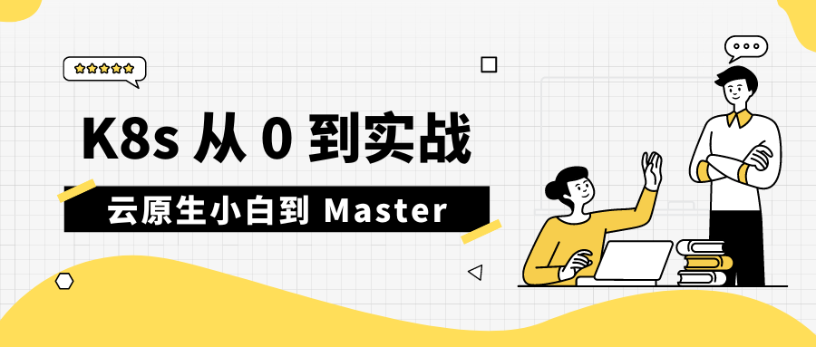

# 入门
- 部署应用到 k8s
- 跨服务调用
- 集群外部访问

# 进阶
- 如何使用配置
- 服务网格实战

# 运维你的应用
- 应用探针
- 滚动更新与回滚
- 优雅采集日志
- 应用可观测性
    - 指标可视化


# 部署应用到 k8s

首先从第一章【部署应用到 k8s】开始，我会用 Go 写一个简单的 Web 应用，然后打包为一个 Docker 镜像，之后部署到 k8s 中，并完成其中的接口调用。

## 编写应用

```go
func main() {  
   http.HandleFunc("/ping", func(w http.ResponseWriter, r *http.Request) {  
      log.Println("ping")  
      fmt.Fprint(w, "pong")  
   })  
  
   http.ListenAndServe(":8081", nil)  
}
```

应用非常简单就是提供了一个 `ping`  接口，然后返回了一个 `pong`.

## Dockerfile

```dockerfile
# 第一阶段：编译 Go 程序  
FROM golang:1.19 AS dependencies  
ENV GOPROXY=https://goproxy.cn,direct  
WORKDIR /go/src/app  
COPY go.mod .  
#COPY ../../go.sum .  
RUN --mount=type=ssh go mod download  
  
# 第二阶段：构建可执行文件  
FROM golang:1.19 AS builder  
WORKDIR /go/src/app  
COPY . .  
#COPY --from=dependencies /go/pkg /go/pkg  
RUN go build  
  
# 第三阶段：部署  
FROM debian:stable-slim  
RUN apt-get update && apt-get install -y curl  
COPY --from=builder /go/src/app/k8s-combat /go/bin/k8s-combat  
ENV PATH="/go/bin:${PATH}"  
  
# 启动 Go 程序  
CMD ["k8s-combat"]
```

之后编写了一个 `dockerfile` 用于构建 `docker` 镜像。

```makefile
docker:  
   @echo "Docker Build..."  
   docker build . -t crossoverjie/k8s-combat:v1 && docker image push crossoverjie/k8s-combat:v1
```

使用 `make docker`  会在本地构建镜像并上传到 `dockerhub`

## 编写 deployment
下一步便是整个过程中最重要的环节了，也是唯一和 k8s 打交道的地方，那就是编写 deployment。

<iframe src="//player.bilibili.com/player.html?aid=702346697&bvid=BV1Cm4y1n7yG&cid=1235124452&page=1" scrolling="no" border="0" frameborder="no" framespacing="0" allowfullscreen="true"> </iframe>

在之前的视频《一分钟了解 k8s》中讲过常见的组件：


其中我们最常见的就是 deployment，通常用于部署无状态应用；现在还不太需要了解其他的组件，先看看 deployment 如何编写：
```yaml
apiVersion: apps/v1  
kind: Deployment  
metadata:  
  labels:  
    app: k8s-combat  
  name: k8s-combat  
spec:  
  replicas: 1  
  selector:  
    matchLabels:  
      app: k8s-combat  
  template:  
    metadata:  
      labels:  
        app: k8s-combat  
    spec:  
      containers:  
        - name: k8s-combat  
          image: crossoverjie/k8s-combat:v1  
          imagePullPolicy: Always  
          resources:  
            limits:  
              cpu: "1"  
              memory: 300Mi  
            requests:  
              cpu: "0.1"  
              memory: 30Mi
```

开头两行的 `apiVersion`  和 `kind` 可以暂时不要关注，就理解为 deployment 的固定写法即可。

metadata：顾名思义就是定义元数据的地方，告诉 `Pod` 我们这个 `deployment` 叫什么名字，这里定义为：`k8s-combat`

中间的：
```yaml
metadata:  
  labels:  
    app: k8s-combat
```

也很容易理解，就是给这个 `deployment` 打上标签，通常是将这个标签和其他的组件进行关联使用才有意义，不然就只是一个标签而已。
> 标签是键值对的格式，key, value 都可以自定义。

而这里的  `app: k8s-combat` 便是和下面的 spec 下的 selector 选择器匹配，表明都使用  `app: k8s-combat`  进行关联。

而 template 中所定义的标签也是为了让选择器和 template 中的定义的 Pod 进行关联。

> Pod 是 k8s 中相同功能容器的分组，一个 Pod 可以绑定多个容器，这里就只有我们应用容器一个了；后续在讲到 istio 和日志采集时便可以看到其他的容器。

template 中定义的内容就很容易理解了，指定了我们的容器拉取地址，以及所占用的资源(`cpu/ memory`)。

`replicas: 1`：表示只部署一个副本，也就是只有一个节点的意思。

## 部署应用

之后我们使用命令:

```shell
kubectl apply -f deployment/deployment.yaml
```

> 生产环境中往往会使用云厂商所提供的 k8s 环境，我们本地可以使用 [https://minikube.sigs.k8s.io/docs/start/](https://minikube.sigs.k8s.io/docs/start/) minikube 来模拟。

就会应用这个 deployment 同时将容器部署到 k8s 中，之后使用:
```shell
kubectl get pod
```
>  在后台 k8s 会根据我们填写的资源选择一个合适的节点，将当前这个 Pod 部署过去。

就会列出我们刚才部署的 Pod:
```shell
❯ kubectl get pod
NAME                                READY   STATUS    RESTARTS   AGE
k8s-combat-57f794c59b-7k58n         1/1     Running   0          17h
```

我们使用命令：
```shell
kubectl exec -it k8s-combat-57f794c59b-7k58n  bash
```
就会进入我们的容器，这个和使用 docker 类似。

之后执行 curl 命令便可以访问我们的接口了：
```shell
root@k8s-combat-57f794c59b-7k58n:/# curl http://127.0.0.1:8081/ping
pong
root@k8s-combat-57f794c59b-7k58n:/#
```

这时候我们再开一个终端执行：
```
❯ kubectl logs -f k8s-combat-57f794c59b-7k58n
2023/09/03 09:28:07 ping
```
便可以打印容器中的日志，当然前提是应用的日志是写入到了标准输出中。